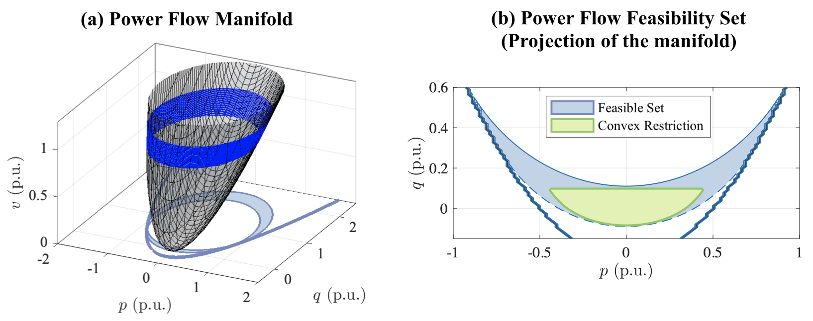

# Visualizing nonconvex constraints in OPF problems

This code provides a visualization of power flow feasibility set, which is defined by the AC power flow equations and operational constraints. The AC power flow equation is a set of nonlinear equations, which creates a nonlinear manifold in high dimension illustrated in Figure (a). The feasibility set projects the manifold onto the power injection space shown in Figure (b).

(The figures are from the reference [2]. Here we provide code for plotting the feasibility set. You can read the references for convex restriction.)

### Color codes

The color and style of the contour represents the type of violated limit.

Solid blue line - Maximum voltage magnitude limit  
Dashed blue line - Minimum voltage magnitude limit  
Solid Yellow line - Maximum reactive power generation & slack bus active power generation limit  
Dashed Yellow line - Minimum reactive power generation & slack bus active power generation limit  
Solid Purple line - Line flow magnitude limit  
Thick solid blue line - Solvability boundary

### Running the code

The script is based on MATLAB and [MATPOWER](https://matpower.org/).
Run 'plot_9bus.m' as an example, which can be run without installation.

## References

This research code was developed and used for the following articles.

[1] Convex Restriction of Power Flow Feasibility Set

    @article{lee2019convex,
      author={Lee, Dongchan and Nguyen, Hung D. and Dvijotham, K. and Turitsyn, Konstantin},
      journal={IEEE Transactions on Control of Network Systems},
      title={Convex Restriction of Power Flow Feasibility Sets},
      year={2019}, volume={6}, number={3}, pages={1235-1245}, month={Sep.}
    }

[2] Feasible Path Identification in Optimal Power Flow with Sequential Convex Restriction

    @article{lee2019feasible,
      title={Feasible Path Identification in Optimal Power Flow with Sequential Convex Restriction},
      author={Lee, Dongchan and Turitsyn, Konstantin and Molzahn, Daniel K and Roald, Line A},
      journal={arXiv preprint arXiv:1906.09483},
      year={2019}
    }
